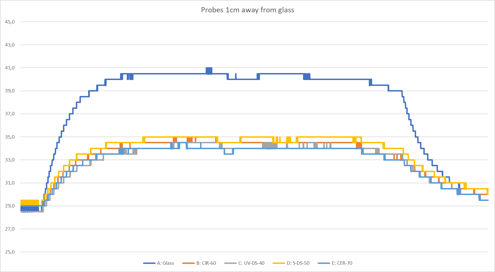
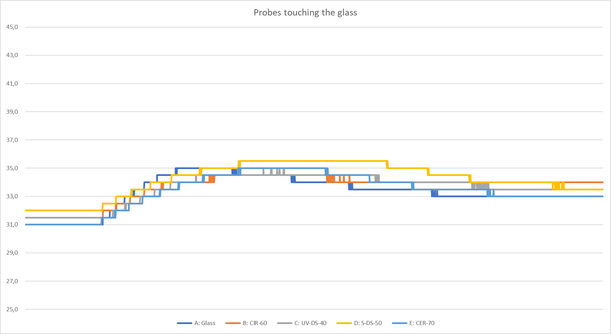
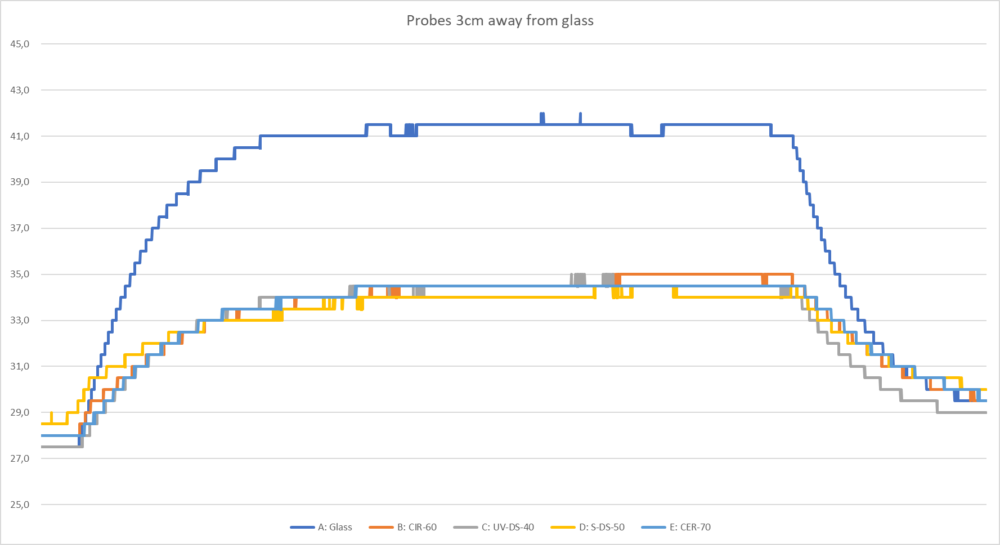
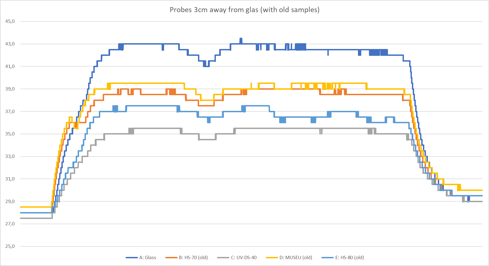
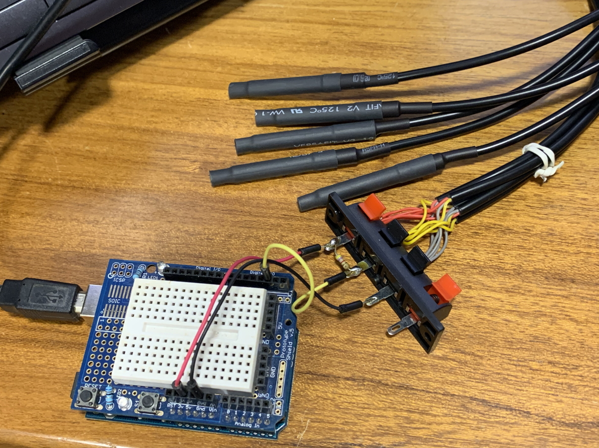
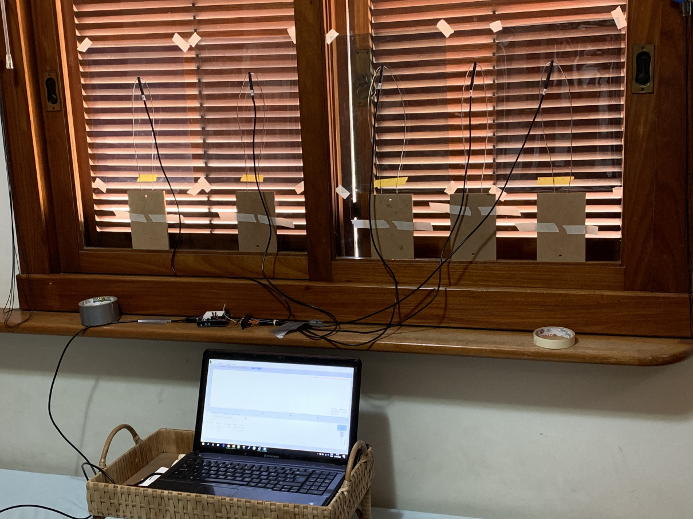
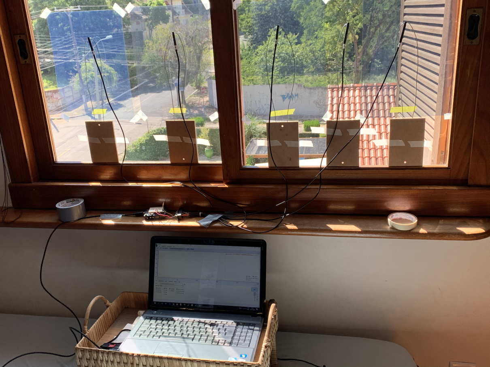
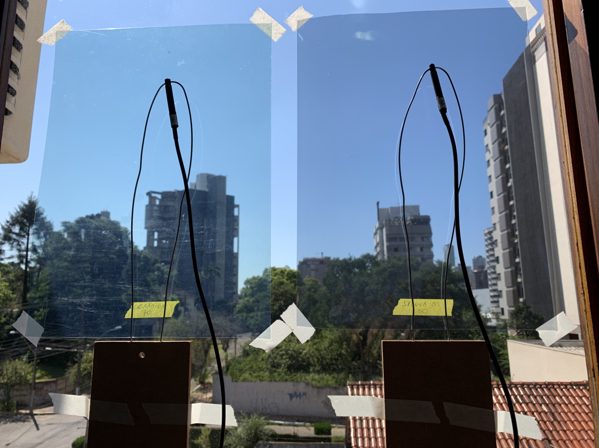

# solar-film-sampling

Experiments to measure the performance of selected architectural solar films

CAH, published 2020-06-02

## Scope

Test four samples of solar film for architectural use obtained in 2020, and also compare with four old samples from 2015.

## Testing methodology

1. Five DS18B20 temperature probes behind a glass pane
2. One of the probes had only the glass in front of it, as a baseline
3. The other four had each a different solar film sample taped to the glass
4. Temperature readings were captured with an Arduino, streamed to the UART and captured using [SerialPlot](https://hackaday.io/project/5334-serialplot-realtime-plotting-software)
5. All five probes started from a shaded state, with the same initial temperature
6. Shortly after staring to capture temperature samples, all probes were exposed to direct sunlight
7. Probes were left in sunlight for about 30min, ensuring temperature stabilization
8. Before stopping the capture of temperature samples, all probes were shaded again, so temperatures dropped and converged

## Results' files

| CSV File                           | XSLX File                           | Description                                                              |
| ---------------------------------- | ----------------------------------- | ------------------------------------------------------------------------ |
| [Test 1 CSV](resources/test_1.csv) | [Test 1 XSLX](resources/test_1.csv) | 2020-03-24_1045 - test 1 (probes 1cm from glass)                         |
| [Test 2 CSV](resources/test_2.csv) | [Test 2 XSLX](resources/test_2.csv) | 2020-03-24_1145 - test 2 (probes touching the glass)                     |
| [Test 3 CSV](resources/test_3.csv) | [Test 3 XSLX](resources/test_3.csv) | 2020-03-25_0910 - test 3 (probes exaclty 3cm away from glass)            |
| [Test 4 CSV](resources/test_4.csv) | [Test 4 XSLX](resources/test_4.csv) | 2020-03-26_0900 - test 4 (probes 3cm away from glass,with 3 old samples) |

## Results' charts

<a href="https://raw.githubusercontent.com/heckler/solar-film-sampling/master/resources/test_1.png" target="_blank">
<a href="https://raw.githubusercontent.com/heckler/solar-film-sampling/master/resources/test_2.png" target="_blank">
<a href="https://raw.githubusercontent.com/heckler/solar-film-sampling/master/resources/test_3.png" target="_blank">
<a href="https://raw.githubusercontent.com/heckler/solar-film-sampling/master/resources/test_4.png" target="_blank">

## Experimental setup images

<a href="https://raw.githubusercontent.com/heckler/solar-film-sampling/master/photos/Setup_01.jpg" target="_blank">
<a href="https://raw.githubusercontent.com/heckler/solar-film-sampling/master/photos/Setup_02.jpg" target="_blank">
<a href="https://raw.githubusercontent.com/heckler/solar-film-sampling/master/photos/Setup_03.jpg" target="_blank">
<a href="https://raw.githubusercontent.com/heckler/solar-film-sampling/master/photos/Setup_04.jpg" target="_blank">
